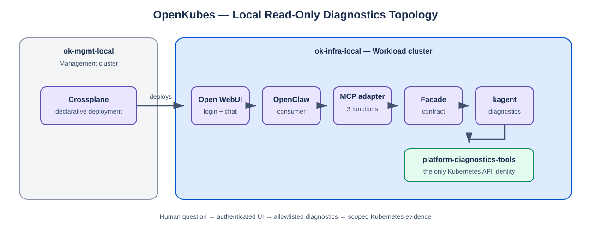
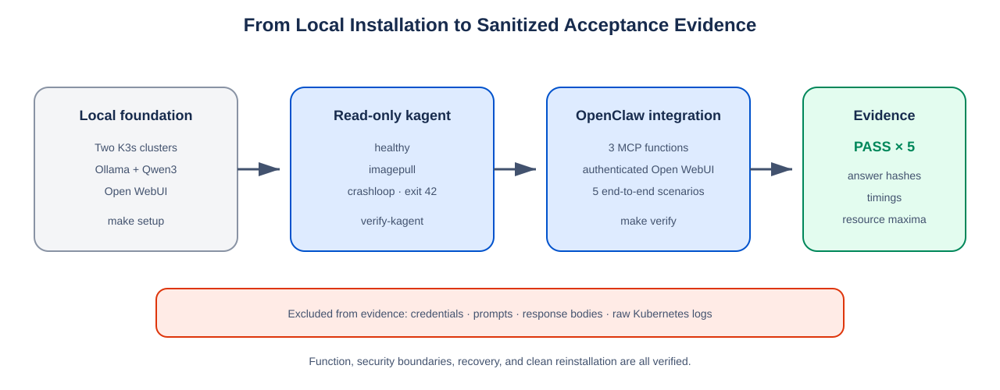

# Read-Only Kubernetes Diagnostics, Made Local — Open WebUI, OpenClaw, and kagent

*By the OpenKubes team*

---

Every platform team experimenting with AI eventually meets the same uncomfortable question: **how much Kubernetes access should the model receive?** The tempting answers are also the dangerous ones. Put a kubeconfig into the chat backend and the blast radius follows every prompt. Give an agent broad permissions and a diagnostic mistake can become an operational incident. Tell the model to “stay read-only” and you have a policy made of words, not an authorization boundary.

OpenKubes takes a stricter position: **the model may explain the cluster, but Kubernetes authority belongs to a small, purpose-built tool boundary.** Our local diagnostics implementation turns that principle into a complete working system. A user asks a question in Open WebUI, OpenClaw selects one of three diagnostic functions, kagent gathers Kubernetes evidence, and the answer returns through the same authenticated path. The AI can observe and explain. It cannot patch, delete, restart, or read Secrets.



**Two clusters preserve the production roles.** The local environment runs two K3s clusters in Multipass. `ok-mgmt-local` represents the management plane and hosts Crossplane. `ok-infra-local` represents the workload plane and runs KubeVirt, Ollama, Open WebUI, kagent, OpenClaw, and the diagnostics services. The split is useful even on a laptop: deployment authority stays separate from the workloads being inspected, and the same responsibility boundaries can later map to production clusters.

**Each component has one deliberately narrow job.** Ollama runs the local Qwen3 model and keeps inference data on the machine. Open WebUI authenticates the user and provides the chat interface. OpenClaw interprets the request and may choose only one of the three allowlisted diagnostic functions. The MCP adapter exposes those functions in the Model Context Protocol and translates each invocation into the diagnostics contract. The facade coordinates the diagnostic request and the calls to kagent. kagent turns that request into bounded Kubernetes observations. Finally, `platform-diagnostics-tools` performs the actual API reads with its dedicated ServiceAccount. No single component combines user authentication, model execution, orchestration, and Kubernetes authority.

| Component | Responsibility | Kubernetes credential |
|---|---|---|
| Ollama | Runs the local language model | No |
| Open WebUI | Authenticates users and provides chat | No |
| OpenClaw | Selects an allowlisted diagnostic function | No |
| MCP adapter | Exposes the three-function MCP surface | No |
| Diagnostics facade | Coordinates the contract request | No |
| kagent | Produces a grounded diagnostic observation | No general read identity |
| `platform-diagnostics-tools` | Reads selected Kubernetes resources | Yes — scoped read-only ServiceAccount |

**The user enters through the real front door.** Open WebUI is not a decorative dashboard beside the test path; it is the authenticated acceptance entry point. Open WebUI calls OpenClaw with a dedicated gateway token. OpenClaw has no Kubernetes credential and sees exactly three external functions: `get_platform_health`, `investigate_workload`, and `collect_diagnostic_evidence`. The MCP adapter translates those calls into the diagnostics contract, the facade coordinates the request, and kagent invokes the scoped tool service. Only that final service talks to the Kubernetes API.

**The three functions describe intent rather than implementation.** `get_platform_health` asks whether the local workload cluster is generally healthy. `investigate_workload` targets one named workload in one namespace and explains its current state. `collect_diagnostic_evidence` gathers the bounded observations needed to support a diagnosis. OpenClaw cannot request an arbitrary shell command or discover a hidden fourth tool. The verifier reads the MCP tool list as structured data and fails if the exposed set differs from those three names.

**A diagnosis is a controlled round trip.** The complete request path works as follows:

1. The user signs in to Open WebUI and selects the `openclaw/default` model.
2. Open WebUI sends the chat request to OpenClaw's cluster-internal OpenAI-compatible endpoint and authenticates with the gateway token.
3. OpenClaw interprets the question and selects one allowlisted MCP function. It passes explicit values for the cluster, namespace, workload, and time range instead of handing the adapter unrestricted text execution.
4. The MCP adapter converts the tool invocation into the diagnostics contract understood by the facade.
5. The facade routes the request to kagent and the scoped tool service. Neither the facade nor OpenClaw can call the Kubernetes API directly.
6. `platform-diagnostics-tools` reads only the permitted Kubernetes resources. For a pod investigation, useful observations include pod phase, readiness conditions, container states, restart counts, waiting or termination reasons, and related events.
7. kagent and the facade turn those observations into a grounded diagnostic result. The adapter returns the structured result to OpenClaw.
8. OpenClaw writes a human-readable explanation, and Open WebUI returns it to the authenticated user. The answer can recommend a next action, but the system has no permission to perform that action.

For example, a user can ask:

```text
Why is the imagepull workload in namespace kagent-lab on
cluster ok-infra-local not starting? Investigate the last hour.
```

OpenClaw maps that question to `investigate_workload` and preserves the contract arguments:

```json
{
  "cluster": "ok-infra-local",
  "namespace": "kagent-lab",
  "workload": "imagepull",
  "time_range": "PT1H"
}
```

The tool service then observes the pod without modifying it. The decisive signals are the container's waiting reason, such as `ImagePullBackOff` or `ErrImagePull`, and the corresponding Kubernetes events. The returned answer should cite those signals and explain that Kubernetes cannot retrieve the configured image. It may suggest checking the image reference, digest, registry, or pull credentials; it cannot edit the Deployment or create an image-pull Secret.


**Read-only is enforced, not requested.** OpenClaw, the adapter, and the facade receive no Kubernetes ServiceAccount token. The kagent agents do not receive general Kubernetes read permissions either. Kubernetes access exists only in `platform-diagnostics-tools`, whose ServiceAccount is limited to explicit `get`, `list`, and `watch` permissions on selected resources. Secret access, write verbs, and wildcard permissions are excluded and tested against the live API server. Prompts describe the intended behavior; RBAC and token mounts enforce it.

**The boundary still holds when the prompt is hostile or mistaken.** A user can ask the model to delete a pod, restart a Deployment, patch an image, or reveal a Secret. OpenClaw still has only the three diagnostic functions, and the only Kubernetes identity still lacks the required verbs and Secret access. A model response might describe a possible remediation command, but a tool call cannot cross the authorization boundary. This distinction matters: refusal text is useful behavior, while RBAC denial is the security property.

**Credentials remain separate by purpose.** An Open WebUI login token authenticates the human or acceptance operator. A different gateway token authenticates Open WebUI to OpenClaw. Neither credential grants Kubernetes access. The selected adapter `0.1.0` and facade `0.1.7` images implement the older `1.0.0-draft` diagnostics contract, so this local profile does not claim the newer Contract-Consumer bearer-token checks those images do not support. Instead, it proves the boundaries the published components can actually enforce: no Kubernetes credential in the consumer path, a three-function allowlist, scoped ingress to the adapter, and read-only RBAC at the tool service.

**Three fixtures turn plausible answers into testable diagnoses.** A healthy pod must be Running and Ready. An image-pull fixture uses an unavailable image and must expose `ImagePullBackOff` or `ErrImagePull`. A crash-loop fixture exits deliberately with code 42 and must show restart and `BackOff` evidence. These are not demo screenshots chosen after the fact. They are reproducible workloads with deterministic Kubernetes signals, which means the verifier can reject an answer that sounds convincing but cites the wrong evidence.



**Installation is an ordered workflow, not a pile of YAML.** First, `make setup` creates the two clusters and installs KubeVirt on the workload cluster. `make tunnels` exposes both Kubernetes APIs locally through separate SSH tunnels. Ollama and the pinned Qwen3 model provide local inference, while the Open WebUI targets create the Crossplane resources and deploy the authenticated user interface. `make -C kagent install` installs the controller, PostgreSQL, dashboard, read-only tool server, and the three fixtures; `make -C kagent verify-kagent` proves the live RBAC and diagnostic behavior. `make -C openclaw install` then adds the facade, MCP adapter, OpenClaw, and the authenticated Open WebUI connection before running the complete verification.

The [Local AI and Open WebUI tutorial](https://github.com/openkubes/ok-local/blob/main/docs/tutorial-ai-webui.md) provides the step-by-step setup for the local model and user interface used by this diagnostic path.

```bash
make setup
make tunnels
make install-ollama
make webui-setup
make webui-deploy

make -C kagent preflight
make -C kagent install
make -C kagent verify-kagent

make -C openclaw preflight
make -C openclaw install
make -C openclaw verify
```

The preflight targets fetch pinned sources into ignored local directories, verify cluster access, validate chart and image locks, and render the inputs before changing the cluster. Installation is idempotent, so the same target can reconcile an existing environment. Image tags alone are not treated as reproducible inputs: the diagnostics adapter and facade are pinned to immutable multi-architecture index digests, and the remaining runtime images and upstream revisions are recorded in source-lock files.

**The complete path passed five authenticated scenarios.** The sanitized acceptance run recorded `PASS` for platform health, a healthy workload, ImagePullBackOff, CrashLoopBackOff, and diagnostic-evidence collection. Every scenario entered through Open WebUI and crossed OpenClaw, MCP, the facade, kagent, and the Kubernetes tool boundary. The results preserve answer hashes, durations, selected contract functions, and sampled resource maxima without retaining prompts, response bodies, raw cluster logs, tokens, or passwords.

The verifier does more than look for a successful HTTP status. It checks that the expected Deployments are ready, image digests match the lock, the facade reports healthy, the MCP surface contains exactly three functions, and cluster, namespace, and workload arguments arrive unchanged. It proves positive read access and negative write, Secret, and wildcard permissions against the live API. It also confirms that OpenClaw has no mounted Kubernetes token and no `kubectl`, then runs the five scenarios through the authenticated Open WebUI proxy rather than bypassing the user-facing entry point with a test-only direct call.

**Local CPU inference makes the trade-off visible.** The healthy-workload scenario completed in about 132 seconds, while the two more complex failure investigations took roughly 14 to 15 minutes. Ollama peaked at about 3.95 CPU cores and 4.26 GiB of memory; OpenClaw peaked at about 405 MiB. Those numbers shaped the implementation: a quantized 4B model, one shared context size, bounded caches, Flash Attention, and timeouts aligned with slow local prompt processing. The result is not instant, but it is measurable, reproducible, and able to run without sending cluster evidence to an external model provider.

**Recovery and removal are part of the contract.** `restart-test` proves that the tool service, agents, facade, adapter, and OpenClaw recover after controlled restarts. `lifecycle-test` removes the OpenClaw integration, verifies the cleanup, installs the same pinned inputs again, and reruns acceptance. Generated sources, local tokens, passwords, kubeconfigs, and rendered directories are ignored by Git. Reproducibility includes proving what comes back after deletion — and proving what must never enter a commit.

**The lesson is the boundary.** The interesting part is not that a chatbot can describe a broken pod. Many systems can produce a plausible explanation. The useful property is that every step is constrained and observable: three exposed functions, one Kubernetes identity, deterministic fixtures, negative RBAC checks, authenticated end-to-end tests, pinned images, and sanitized evidence. The model remains replaceable. The diagnostic contract and the security boundary remain stable.

**Where the code lives.** The complete local implementation is available in the public [`openkubes/ok-local`](https://github.com/openkubes/ok-local) repository. The read-only kagent installation and verification live under [`kagent/`](https://github.com/openkubes/ok-local/tree/feature/kagent), while the OpenClaw consumer path, pinned diagnostics images, lifecycle tests, and sanitized acceptance evidence live under [`openclaw/`](https://github.com/openkubes/ok-local/tree/feature/openclaw).

*Author's note: Timings and resource figures in this article come from sanitized acceptance evidence generated on the local CPU environment. Credentials, prompts, response bodies, and raw Kubernetes logs are intentionally excluded from that record.*
